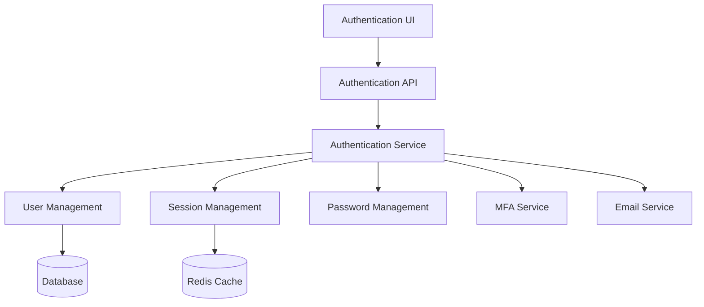
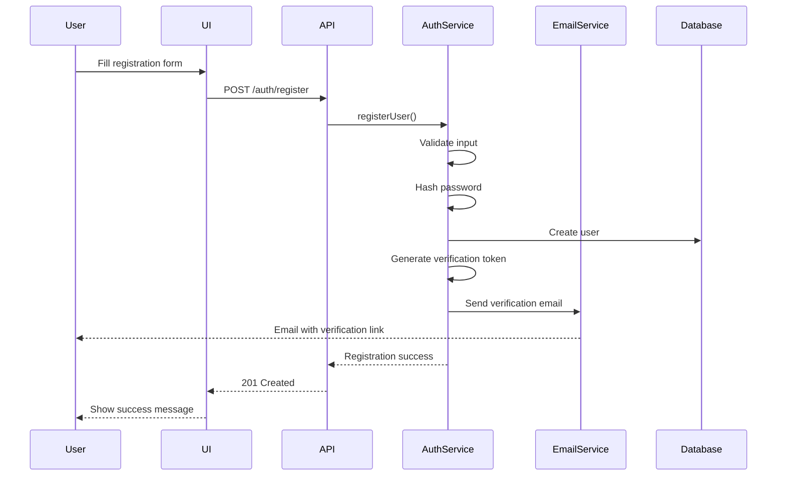
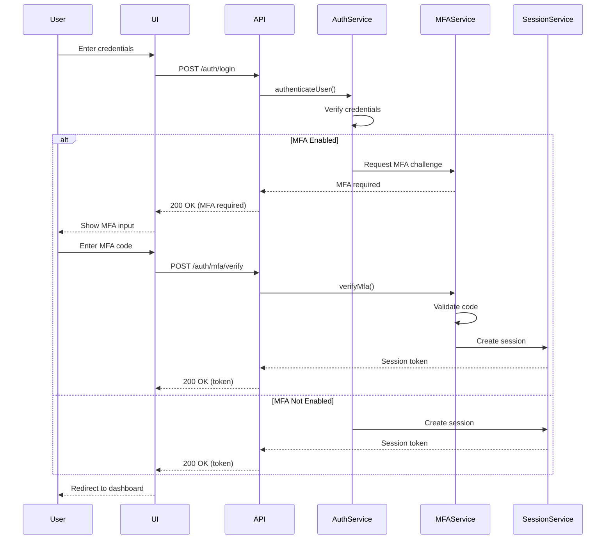
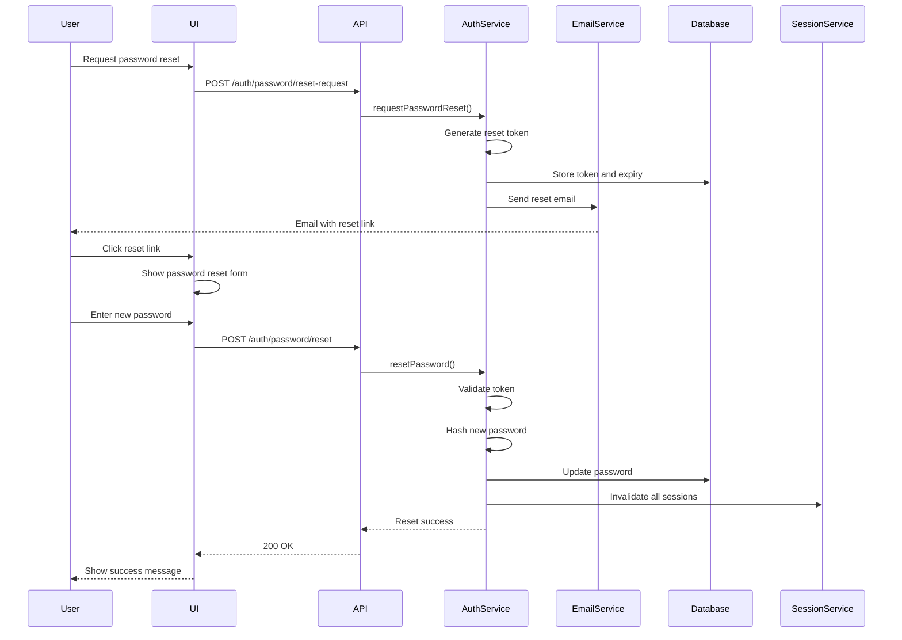

# Design Document: Authentication System

## Overview

The Authentication System provides secure user registration, login, and account management capabilities for the Customer Account Management platform. This design document outlines the architecture, components, security considerations, and implementation details for building a robust authentication system that follows industry best practices.

## Architecture

The authentication system will follow a layered architecture with clear separation of concerns:



### Key Architectural Components:

1. **Authentication UI**: 
   - Registration form
   - Login form
   - Password reset flow
   - MFA setup and verification
   - Account management screens

2. **Authentication API**:
   - RESTful endpoints for authentication operations
   - JWT token issuance and validation
   - Rate limiting and security headers

3. **Authentication Service**:
   - Core business logic for authentication flows
   - Integration with other services
   - Security policy enforcement

4. **User Management**:
   - User CRUD operations
   - Role and permission management
   - Account verification

5. **Session Management**:
   - Session creation and validation
   - Session expiration and revocation
   - Device tracking

6. **Password Management**:
   - Password hashing and verification
   - Password reset flows
   - Password strength enforcement

7. **MFA Service**:
   - TOTP generation and validation
   - Recovery code management
   - MFA enrollment

8. **Email Service**:
   - Verification emails
   - Password reset emails
   - Security notifications

## Components and Interfaces

### 1. User Model

```typescript
interface User {
  id: string;
  email: string;
  passwordHash: string;
  firstName: string;
  lastName: string;
  isEmailVerified: boolean;
  verificationToken?: string;
  verificationTokenExpiry?: Date;
  resetToken?: string;
  resetTokenExpiry?: Date;
  mfaEnabled: boolean;
  mfaSecret?: string;
  recoveryCodes?: string[];
  lastLogin?: Date;
  failedLoginAttempts: number;
  lockedUntil?: Date;
  roles: Role[];
  createdAt: Date;
  updatedAt: Date;
}

enum Role {
  ADMIN = 'ADMIN',
  MANAGER = 'MANAGER',
  USER = 'USER'
}

interface Permission {
  id: string;
  name: string;
  description: string;
}

interface RolePermission {
  roleId: string;
  permissionId: string;
}
```

### 2. Authentication Controller

```typescript
interface IAuthController {
  register(userData: RegisterDto): Promise<{ message: string }>;
  verifyEmail(token: string): Promise<{ message: string }>;
  login(credentials: LoginDto): Promise<{ token: string; user: UserDto }>;
  requestPasswordReset(email: string): Promise<{ message: string }>;
  resetPassword(token: string, newPassword: string): Promise<{ message: string }>;
  refreshToken(token: string): Promise<{ token: string }>;
  logout(token: string): Promise<{ message: string }>;
  setupMfa(): Promise<{ secret: string; qrCode: string }>;
  verifyMfa(token: string, code: string): Promise<{ token: string }>;
  disableMfa(token: string, code: string): Promise<{ message: string }>;
  getRecoveryCodes(token: string): Promise<{ recoveryCodes: string[] }>;
  regenerateRecoveryCodes(token: string, code: string): Promise<{ recoveryCodes: string[] }>;
}
```

### 3. Authentication Service

```typescript
interface IAuthService {
  registerUser(userData: RegisterDto): Promise<User>;
  verifyEmail(token: string): Promise<User>;
  authenticateUser(email: string, password: string): Promise<User>;
  createSession(user: User): Promise<string>;
  validateSession(token: string): Promise<User>;
  invalidateSession(token: string): Promise<void>;
  requestPasswordReset(email: string): Promise<void>;
  resetPassword(token: string, newPassword: string): Promise<User>;
  setupMfa(userId: string): Promise<{ secret: string; qrCode: string }>;
  verifyMfa(userId: string, code: string): Promise<boolean>;
  disableMfa(userId: string, code: string): Promise<User>;
  generateRecoveryCodes(userId: string): Promise<string[]>;
  validateRecoveryCode(userId: string, code: string): Promise<boolean>;
  checkUserPermissions(userId: string, requiredPermissions: string[]): Promise<boolean>;
}
```

### 4. User Repository

```typescript
interface IUserRepository {
  findById(id: string): Promise<User | null>;
  findByEmail(email: string): Promise<User | null>;
  findByVerificationToken(token: string): Promise<User | null>;
  findByResetToken(token: string): Promise<User | null>;
  create(userData: Partial<User>): Promise<User>;
  update(id: string, userData: Partial<User>): Promise<User>;
  delete(id: string): Promise<void>;
  getUserRoles(userId: string): Promise<Role[]>;
  getUserPermissions(userId: string): Promise<Permission[]>;
}
```

### 5. Session Service

```typescript
interface ISessionService {
  createSession(userId: string, deviceInfo?: DeviceInfo): Promise<string>;
  validateSession(token: string): Promise<SessionData | null>;
  invalidateSession(token: string): Promise<void>;
  invalidateAllUserSessions(userId: string): Promise<void>;
  getActiveSessions(userId: string): Promise<SessionInfo[]>;
}

interface SessionData {
  userId: string;
  issuedAt: number;
  expiresAt: number;
  deviceInfo?: DeviceInfo;
}

interface DeviceInfo {
  ip: string;
  userAgent: string;
  deviceId?: string;
}

interface SessionInfo {
  id: string;
  deviceInfo: DeviceInfo;
  createdAt: Date;
  lastActive: Date;
}
```

## Security Considerations

### 1. Password Security

1. **Hashing**: Use Argon2id for password hashing with appropriate parameters:
   - Memory cost: 65536 KiB
   - Time cost: 3 iterations
   - Parallelism: 4
   - Salt: 16 bytes, randomly generated per password

2. **Password Requirements**:
   - Minimum length: 12 characters
   - Must contain: uppercase, lowercase, number, special character
   - Check against common password lists
   - Prevent password reuse (last 5 passwords)

3. **Password Reset**:
   - Time-limited tokens (15 minutes)
   - Single-use tokens
   - Secure delivery via email only
   - Rate limiting on reset requests

### 2. Session Security

1. **JWT Configuration**:
   - Short expiration time (15 minutes)
   - Refresh tokens with longer expiration (7 days)
   - Secure, HTTP-only cookies
   - Signed with RS256 (asymmetric)
   - Include minimal payload data

2. **Session Management**:
   - Server-side session validation
   - Absolute session timeout (24 hours)
   - Inactivity timeout (30 minutes)
   - Session invalidation on password change
   - Device tracking and anomaly detection

### 3. MFA Implementation

1. **TOTP Configuration**:
   - 6-digit codes
   - 30-second window
   - SHA-256 algorithm
   - Secure secret storage (encrypted)

2. **Recovery Options**:
   - One-time use recovery codes (10)
   - Secure delivery and storage
   - Regeneration capability

### 4. API Security

1. **Rate Limiting**:
   - Login: 5 attempts per minute per IP
   - Registration: 3 attempts per hour per IP
   - Password reset: 3 attempts per hour per account
   - API endpoints: 60 requests per minute per token

2. **Security Headers**:
   - Content-Security-Policy
   - X-XSS-Protection
   - X-Content-Type-Options
   - Strict-Transport-Security
   - X-Frame-Options

3. **CSRF Protection**:
   - Double submit cookie pattern
   - SameSite cookie attribute
   - Origin validation

## Data Flow

### Registration Flow



### Login Flow



### Password Reset Flow



## Database Schema

### Users Table

```sql
CREATE TABLE users (
  id UUID PRIMARY KEY DEFAULT uuid_generate_v4(),
  email VARCHAR(255) UNIQUE NOT NULL,
  password_hash VARCHAR(255) NOT NULL,
  first_name VARCHAR(100) NOT NULL,
  last_name VARCHAR(100) NOT NULL,
  is_email_verified BOOLEAN DEFAULT FALSE,
  verification_token VARCHAR(255),
  verification_token_expiry TIMESTAMP,
  reset_token VARCHAR(255),
  reset_token_expiry TIMESTAMP,
  mfa_enabled BOOLEAN DEFAULT FALSE,
  mfa_secret VARCHAR(255),
  last_login TIMESTAMP,
  failed_login_attempts INTEGER DEFAULT 0,
  locked_until TIMESTAMP,
  created_at TIMESTAMP NOT NULL DEFAULT NOW(),
  updated_at TIMESTAMP NOT NULL DEFAULT NOW()
);
```

### Recovery Codes Table

```sql
CREATE TABLE recovery_codes (
  id UUID PRIMARY KEY DEFAULT uuid_generate_v4(),
  user_id UUID NOT NULL REFERENCES users(id) ON DELETE CASCADE,
  code_hash VARCHAR(255) NOT NULL,
  is_used BOOLEAN DEFAULT FALSE,
  created_at TIMESTAMP NOT NULL DEFAULT NOW(),
  used_at TIMESTAMP
);
```

### Roles Table

```sql
CREATE TABLE roles (
  id UUID PRIMARY KEY DEFAULT uuid_generate_v4(),
  name VARCHAR(50) UNIQUE NOT NULL,
  description VARCHAR(255),
  created_at TIMESTAMP NOT NULL DEFAULT NOW()
);
```

### User Roles Table

```sql
CREATE TABLE user_roles (
  user_id UUID NOT NULL REFERENCES users(id) ON DELETE CASCADE,
  role_id UUID NOT NULL REFERENCES roles(id) ON DELETE CASCADE,
  created_at TIMESTAMP NOT NULL DEFAULT NOW(),
  PRIMARY KEY (user_id, role_id)
);
```

### Permissions Table

```sql
CREATE TABLE permissions (
  id UUID PRIMARY KEY DEFAULT uuid_generate_v4(),
  name VARCHAR(100) UNIQUE NOT NULL,
  description VARCHAR(255),
  created_at TIMESTAMP NOT NULL DEFAULT NOW()
);
```

### Role Permissions Table

```sql
CREATE TABLE role_permissions (
  role_id UUID NOT NULL REFERENCES roles(id) ON DELETE CASCADE,
  permission_id UUID NOT NULL REFERENCES permissions(id) ON DELETE CASCADE,
  created_at TIMESTAMP NOT NULL DEFAULT NOW(),
  PRIMARY KEY (role_id, permission_id)
);
```

### Sessions Table (Optional, if not using Redis)

```sql
CREATE TABLE sessions (
  id UUID PRIMARY KEY DEFAULT uuid_generate_v4(),
  user_id UUID NOT NULL REFERENCES users(id) ON DELETE CASCADE,
  token_hash VARCHAR(255) NOT NULL,
  ip_address VARCHAR(45),
  user_agent TEXT,
  device_id VARCHAR(255),
  expires_at TIMESTAMP NOT NULL,
  created_at TIMESTAMP NOT NULL DEFAULT NOW(),
  last_active_at TIMESTAMP NOT NULL DEFAULT NOW()
);
```

## API Endpoints

### Authentication Endpoints

| Method | Endpoint                    | Description                           | Request Body                                | Response                                  |
|--------|----------------------------|---------------------------------------|---------------------------------------------|-------------------------------------------|
| POST   | /api/auth/register          | Register a new user                   | `{ email, password, firstName, lastName }`  | `{ message, userId }`                     |
| POST   | /api/auth/verify-email      | Verify email address                  | `{ token }`                                | `{ message }`                             |
| POST   | /api/auth/login             | Log in a user                         | `{ email, password }`                       | `{ token, user }` or `{ mfaRequired: true }` |
| POST   | /api/auth/mfa/verify        | Verify MFA code                       | `{ token, code }`                          | `{ token, user }`                         |
| POST   | /api/auth/mfa/setup         | Set up MFA                            | `{ token }`                                | `{ secret, qrCode }`                      |
| POST   | /api/auth/mfa/confirm       | Confirm MFA setup                     | `{ token, code }`                          | `{ message, recoveryCodes }`              |
| POST   | /api/auth/mfa/disable       | Disable MFA                           | `{ token, code }`                          | `{ message }`                             |
| POST   | /api/auth/password/reset-request | Request password reset           | `{ email }`                                | `{ message }`                             |
| POST   | /api/auth/password/reset    | Reset password                        | `{ token, password }`                      | `{ message }`                             |
| POST   | /api/auth/logout            | Log out a user                        | `{ token }`                                | `{ message }`                             |
| POST   | /api/auth/token/refresh     | Refresh authentication token          | `{ refreshToken }`                         | `{ token, refreshToken }`                 |

### User Management Endpoints

| Method | Endpoint                    | Description                           | Request Body                                | Response                                  |
|--------|----------------------------|---------------------------------------|---------------------------------------------|-------------------------------------------|
| GET    | /api/users/me               | Get current user profile              | -                                           | `{ user }`                                |
| PUT    | /api/users/me               | Update current user profile           | `{ firstName, lastName, etc. }`            | `{ user }`                                |
| PUT    | /api/users/me/password      | Change password                       | `{ currentPassword, newPassword }`         | `{ message }`                             |
| GET    | /api/users/me/sessions      | List active sessions                  | -                                           | `{ sessions: [] }`                        |
| DELETE | /api/users/me/sessions/:id  | Revoke specific session               | -                                           | `{ message }`                             |
| DELETE | /api/users/me/sessions      | Revoke all sessions                   | -                                           | `{ message }`                             |

### Admin Endpoints

| Method | Endpoint                    | Description                           | Request Body                                | Response                                  |
|--------|----------------------------|---------------------------------------|---------------------------------------------|-------------------------------------------|
| GET    | /api/admin/users            | List all users                        | -                                           | `{ users: [], total, page, pageSize }`    |
| GET    | /api/admin/users/:id        | Get user details                      | -                                           | `{ user }`                                |
| PUT    | /api/admin/users/:id        | Update user                           | `{ firstName, lastName, roles, etc. }`     | `{ user }`                                |
| DELETE | /api/admin/users/:id        | Delete user                           | -                                           | `{ message }`                             |
| PUT    | /api/admin/users/:id/roles  | Update user roles                     | `{ roles: [] }`                            | `{ user, roles }`                         |

## Frontend Components

### 1. Registration Form

```typescript
interface RegistrationFormProps {
  onSubmit: (data: RegistrationData) => Promise<void>;
  isLoading: boolean;
}

interface RegistrationData {
  email: string;
  password: string;
  confirmPassword: string;
  firstName: string;
  lastName: string;
}
```

### 2. Login Form

```typescript
interface LoginFormProps {
  onSubmit: (data: LoginData) => Promise<void>;
  isLoading: boolean;
}

interface LoginData {
  email: string;
  password: string;
  rememberMe?: boolean;
}
```

### 3. MFA Verification Form

```typescript
interface MfaVerificationFormProps {
  onSubmit: (code: string) => Promise<void>;
  onUseRecoveryCode: () => void;
  isLoading: boolean;
}
```

### 4. MFA Setup Component

```typescript
interface MfaSetupProps {
  secret: string;
  qrCodeUrl: string;
  onVerify: (code: string) => Promise<void>;
  onCancel: () => void;
  isLoading: boolean;
}
```

### 5. Password Reset Form

```typescript
interface PasswordResetFormProps {
  token: string;
  onSubmit: (data: PasswordResetData) => Promise<void>;
  isLoading: boolean;
}

interface PasswordResetData {
  password: string;
  confirmPassword: string;
}
```

## Implementation Approach

### 1. Security First

- Implement security measures from the beginning, not as an afterthought
- Follow OWASP Top 10 guidelines
- Use established libraries for cryptographic operations
- Regular security audits and penetration testing

### 2. Progressive Enhancement

- Start with core authentication (registration, login, logout)
- Add email verification
- Implement password management features
- Add MFA support
- Implement role-based access control

### 3. Testing Strategy

- Unit tests for all security-critical functions
- Integration tests for authentication flows
- Security-focused tests (brute force, token validation, etc.)
- End-to-end tests for complete user journeys

## Deployment Considerations

### 1. Environment Configuration

- Separate configurations for development, testing, and production
- Environment variables for sensitive configuration
- Secrets management for production keys

### 2. Security Headers and HTTPS

- Enforce HTTPS in production
- Implement security headers
- Configure proper CORS settings

### 3. Monitoring and Alerting

- Log all authentication events
- Set up alerts for suspicious activities
- Monitor failed login attempts
- Track session usage patterns

## Dependencies

1. **Authentication**:
   - Argon2 for password hashing
   - JWT for token-based authentication
   - TOTP library for MFA

2. **Storage**:
   - PostgreSQL for user data
   - Redis for session management

3. **Email**:
   - SMTP service for sending emails
   - Email templates for verification and reset emails

4. **Frontend**:
   - React for UI components
   - Form validation library
   - QR code generation for MFA setup