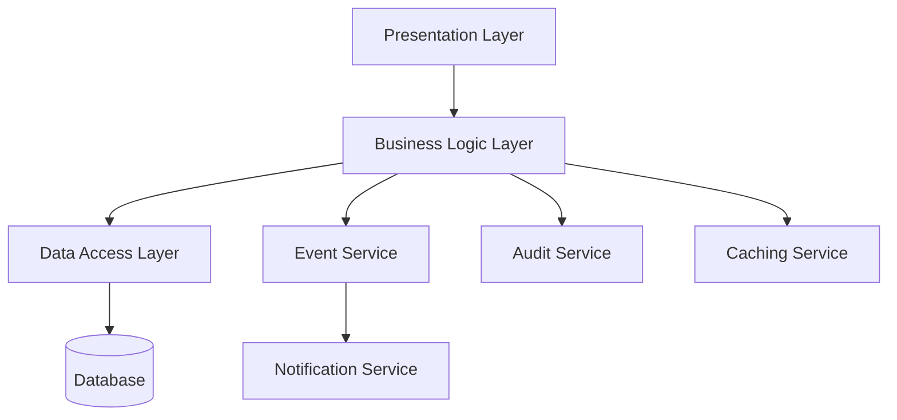

# Design Document: Customer Account Management

## Overview

The Customer Account Management module is a core component of the CRM platform that enables Sales Managers to create, view, update, and delete customer accounts. This design document outlines the architecture, components, data models, and other technical aspects required to implement this feature in accordance with the requirements.

## Architecture

The Customer Account Management feature will follow a layered architecture pattern with clear separation of concerns:



### Key Architectural Components:

1. **Presentation Layer**: 
   - Web interface for user interactions
   - API endpoints for programmatic access
   - Responsive design supporting multiple device types

2. **Business Logic Layer**:
   - Account service for core CRUD operations
   - Validation service for data integrity
   - Permission service for access control
   - Search service for efficient account discovery

3. **Data Access Layer**:
   - Repository pattern implementation
   - ORM integration
   - Query optimization

4. **Cross-Cutting Concerns**:
   - Logging and monitoring
   - Error handling
   - Caching strategy
   - Event publishing

5. **External Services**:
   - Notification service integration
   - Audit service for compliance
   - Search indexing service

## Components and Interfaces

### 1. Account Controller

Responsible for handling HTTP requests related to account management.

```typescript
interface IAccountController {
  getAccounts(filters: AccountFilters, pagination: PaginationParams): Promise<PaginatedResponse<Account>>;
  getAccountById(id: string): Promise<Account>;
  createAccount(account: AccountCreateDto): Promise<Account>;
  updateAccount(id: string, account: AccountUpdateDto): Promise<Account>;
  deleteAccount(id: string): Promise<void>;
  searchAccounts(searchParams: SearchParams): Promise<PaginatedResponse<Account>>;
  getAccountRelationships(id: string): Promise<AccountRelationships>;
  updateAccountRelationships(id: string, relationships: RelationshipUpdateDto): Promise<AccountRelationships>;
}
```

### 2. Account Service

Implements business logic for account management operations.

```typescript
interface IAccountService {
  getAccounts(filters: AccountFilters, pagination: PaginationParams): Promise<PaginatedResponse<Account>>;
  getAccountById(id: string): Promise<Account>;
  createAccount(account: AccountCreateDto, userId: string): Promise<Account>;
  updateAccount(id: string, account: AccountUpdateDto, userId: string): Promise<Account>;
  deleteAccount(id: string, userId: string): Promise<void>;
  searchAccounts(searchParams: SearchParams): Promise<PaginatedResponse<Account>>;
  getAccountRelationships(id: string): Promise<AccountRelationships>;
  updateAccountRelationships(id: string, relationships: RelationshipUpdateDto, userId: string): Promise<AccountRelationships>;
  validateAccountData(account: AccountDto): ValidationResult;
  checkCircularRelationships(parentId: string, childId: string): boolean;
}
```

### 3. Account Repository

Handles data access operations for accounts.

```typescript
interface IAccountRepository {
  findAll(filters: AccountFilters, pagination: PaginationParams): Promise<PaginatedResponse<Account>>;
  findById(id: string): Promise<Account>;
  create(account: AccountCreateDto): Promise<Account>;
  update(id: string, account: AccountUpdateDto): Promise<Account>;
  delete(id: string): Promise<void>;
  search(searchParams: SearchParams): Promise<PaginatedResponse<Account>>;
  getRelationships(id: string): Promise<AccountRelationships>;
  updateRelationships(id: string, relationships: RelationshipUpdateDto): Promise<AccountRelationships>;
  checkExistingRelationship(parentId: string, childId: string): Promise<boolean>;
}
```

### 4. Permission Service

Manages access control for account operations.

```typescript
interface IPermissionService {
  canViewAccount(userId: string, accountId: string): Promise<boolean>;
  canCreateAccount(userId: string): Promise<boolean>;
  canUpdateAccount(userId: string, accountId: string): Promise<boolean>;
  canDeleteAccount(userId: string, accountId: string): Promise<boolean>;
  filterAccountsByPermission(userId: string, accounts: Account[]): Promise<Account[]>;
}
```

### 5. Audit Service

Records audit trails for compliance and tracking.

```typescript
interface IAuditService {
  logAccountCreation(account: Account, userId: string): Promise<void>;
  logAccountUpdate(accountId: string, changes: object, userId: string): Promise<void>;
  logAccountDeletion(accountId: string, userId: string): Promise<void>;
  logAccountAccess(accountId: string, userId: string): Promise<void>;
  getAccountAuditTrail(accountId: string): Promise<AuditEntry[]>;
}
```

## Data Models

### Account Model

```typescript
interface Account {
  id: string;
  name: string;
  industry: string;
  type: AccountType;
  website: string;
  phone: string;
  email: string;
  billingAddress: Address;
  shippingAddress: Address;
  description: string;
  annualRevenue: number;
  employeeCount: number;
  status: AccountStatus;
  tags: string[];
  customFields: Record<string, any>;
  createdBy: string;
  createdAt: Date;
  updatedBy: string;
  updatedAt: Date;
}

enum AccountType {
  CUSTOMER,
  PROSPECT,
  PARTNER,
  COMPETITOR,
  OTHER
}

enum AccountStatus {
  ACTIVE,
  INACTIVE,
  PENDING,
  CLOSED
}

interface Address {
  street: string;
  city: string;
  state: string;
  postalCode: string;
  country: string;
}
```

### Account Relationship Model

```typescript
interface AccountRelationship {
  id: string;
  parentAccountId: string;
  childAccountId: string;
  relationshipType: RelationshipType;
  createdBy: string;
  createdAt: Date;
}

enum RelationshipType {
  PARENT_CHILD,
  AFFILIATE,
  PARTNER,
  SUBSIDIARY,
  OTHER
}

interface AccountRelationships {
  parentRelationships: AccountRelationship[];
  childRelationships: AccountRelationship[];
}
```

### DTOs

```typescript
interface AccountCreateDto {
  name: string;
  industry: string;
  type: AccountType;
  website?: string;
  phone?: string;
  email?: string;
  billingAddress?: Address;
  shippingAddress?: Address;
  description?: string;
  annualRevenue?: number;
  employeeCount?: number;
  status: AccountStatus;
  tags?: string[];
  customFields?: Record<string, any>;
}

interface AccountUpdateDto {
  name?: string;
  industry?: string;
  type?: AccountType;
  website?: string;
  phone?: string;
  email?: string;
  billingAddress?: Address;
  shippingAddress?: Address;
  description?: string;
  annualRevenue?: number;
  employeeCount?: number;
  status?: AccountStatus;
  tags?: string[];
  customFields?: Record<string, any>;
}

interface RelationshipUpdateDto {
  addRelationships: {
    targetAccountId: string;
    relationshipType: RelationshipType;
    isParent: boolean;
  }[];
  removeRelationships: string[]; // relationship IDs to remove
}
```

## Error Handling

The system will implement a comprehensive error handling strategy:

1. **Validation Errors**:
   - Input validation at controller level
   - Business rule validation at service level
   - Detailed error messages for client consumption

2. **Permission Errors**:
   - Clear unauthorized access messages
   - Logging of access attempts for security monitoring

3. **Concurrency Errors**:
   - Optimistic concurrency control using version/timestamp
   - Clear messaging for conflict resolution

4. **System Errors**:
   - Graceful degradation
   - Detailed internal logging
   - Generic error messages to clients

Error responses will follow a consistent format:

```json
{
  "status": 400,
  "code": "VALIDATION_ERROR",
  "message": "Account creation failed due to validation errors",
  "details": [
    {
      "field": "name",
      "error": "Account name is required"
    },
    {
      "field": "industry",
      "error": "Industry must be selected from the provided options"
    }
  ]
}
```

## Caching Strategy

To meet the performance requirements (NF4: sub-200ms API response times), the system will implement:

1. **Read-Through Cache**:
   - Cache frequently accessed accounts
   - Cache search results for common queries
   - TTL-based invalidation strategy

2. **Cache Invalidation**:
   - Event-based invalidation on account updates
   - Selective invalidation to minimize cache churn

3. **Distributed Caching**:
   - Redis as the caching technology
   - Consistent hashing for distribution

## Security Considerations

To meet compliance requirements (NF3: GDPR and SOC2):

1. **Data Encryption**:
   - Encryption at rest for all PII
   - TLS for data in transit

2. **Access Control**:
   - Role-based access control
   - Attribute-based access control for fine-grained permissions
   - JWT-based authentication

3. **Audit Logging**:
   - Comprehensive audit trails
   - Immutable audit records
   - Configurable retention policies

4. **Data Retention**:
   - Configurable retention policies
   - Data anonymization capabilities
   - Complete data removal functionality

## Testing Strategy

### Unit Testing

- Test individual components in isolation
- Mock dependencies
- Focus on business logic validation
- Aim for >90% code coverage

### Integration Testing

- Test component interactions
- Focus on data flow between layers
- Test database operations
- Validate event publishing and consumption

### Performance Testing

- Load testing to validate NF1 (10,000 concurrent users)
- Response time testing for NF4 (sub-200ms)
- Stress testing to identify breaking points
- Endurance testing for stability

### Security Testing

- Penetration testing
- OWASP Top 10 vulnerability scanning
- Data encryption validation
- Access control testing

### Compliance Testing

- GDPR compliance validation
- SOC2 control testing
- Audit trail verification
- Data export and deletion testing

## Deployment Considerations

To ensure 99.9% uptime (NF2):

1. **High Availability**:
   - Multi-region deployment
   - Load balancing
   - Auto-scaling configuration

2. **Monitoring**:
   - Real-time performance monitoring
   - Proactive alerting
   - Detailed logging

3. **Disaster Recovery**:
   - Regular backups
   - Point-in-time recovery
   - Failover testing

4. **Deployment Strategy**:
   - Blue-green deployment
   - Canary releases
   - Automated rollback capabilities