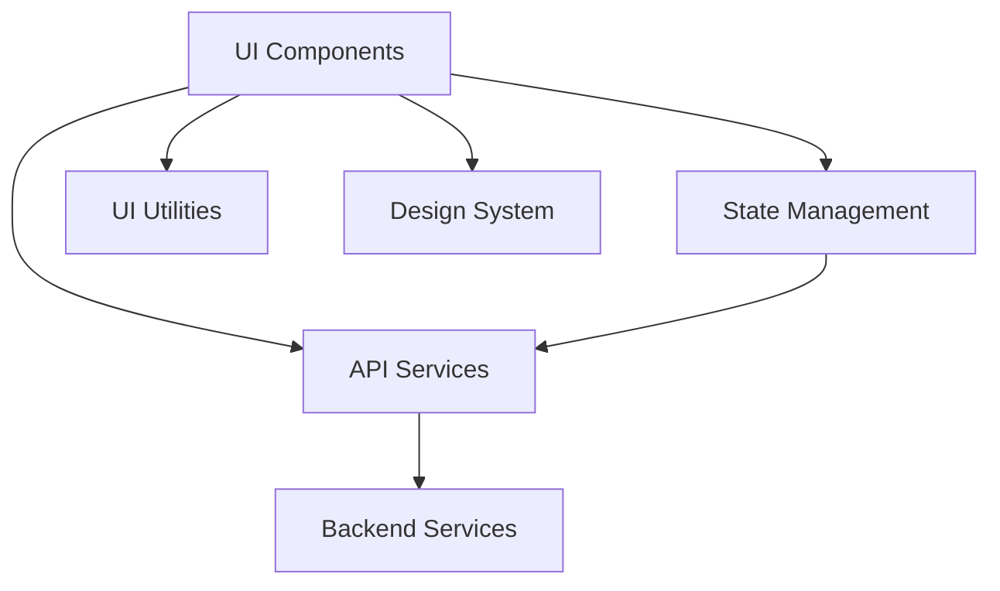

# Design Document: Enterprise-Grade UI for Customer Account Management

## Overview

The Enterprise-Grade UI for Customer Account Management is designed to provide a modern, intuitive, and feature-rich interface for managing customer accounts within the CRM platform. This design document outlines the architecture, components, user experience, and technical considerations for implementing this enterprise-level UI.

## Architecture

The UI will follow a modern front-end architecture with clear separation of concerns:



### Key Architectural Components:

1. **UI Components**: 
   - Modular, reusable React components
   - Component hierarchy with smart (container) and dumb (presentational) components
   - Lazy-loaded components for performance optimization

2. **State Management**:
   - Centralized state management using Redux or Context API
   - Optimistic UI updates for improved perceived performance
   - Caching and memoization strategies

3. **API Services**:
   - RESTful API integration layer
   - Request/response interceptors
   - Error handling and retry mechanisms

4. **UI Utilities**:
   - Form validation and handling
   - Date/time formatting
   - Internationalization (i18n)
   - Analytics tracking

5. **Design System**:
   - Consistent component library
   - Typography system
   - Color palette and theming
   - Spacing and layout guidelines
   - Accessibility compliance

## Components and Interfaces

### 1. Dashboard

The dashboard will serve as the main entry point to the application, providing an overview of account data and quick access to common actions.

```typescript
interface DashboardProps {
  accountMetrics: AccountMetrics;
  recentAccounts: Account[];
  userPreferences: UserPreferences;
  onRefresh: () => void;
}

interface AccountMetrics {
  totalAccounts: number;
  accountsByStatus: Record<AccountStatus, number>;
  accountsByType: Record<AccountType, number>;
  newAccountsThisMonth: number;
  accountsUpdatedThisWeek: number;
}
```

#### Dashboard Layout:

```
+-----------------------------------------------+
| Header (Logo, Search, User Menu)              |
+-----------------------------------------------+
| Quick Actions | Account Metrics | Recent      |
| - New Account | - Total: 1,234  | Activity    |
| - Search      | - Active: 890   | - Account X |
| - Import      | - Inactive: 344 | - Account Y |
+---------------+----------------+-------------+
| Account Distribution (Charts)                 |
| +----------------+  +-------------------+     |
| | By Status      |  | By Industry       |     |
| | (Pie Chart)    |  | (Bar Chart)       |     |
| +----------------+  +-------------------+     |
+-----------------------------------------------+
| Recent Accounts (Table)                       |
| +------+----------+--------+--------+------+  |
| | Name | Industry | Status | Type   | ...  |  |
| +------+----------+--------+--------+------+  |
| | ...  | ...      | ...    | ...    | ...  |  |
| +------+----------+--------+--------+------+  |
+-----------------------------------------------+
```

### 2. Account List

The account list will provide a comprehensive view of all accounts with advanced filtering, sorting, and bulk action capabilities.

```typescript
interface AccountListProps {
  accounts: PaginatedResponse<Account>;
  filters: AccountFilters;
  sorting: SortingOptions;
  selectedAccounts: string[]; // Account IDs
  onFilterChange: (filters: AccountFilters) => void;
  onSortChange: (sorting: SortingOptions) => void;
  onPageChange: (page: number) => void;
  onSelectionChange: (selectedIds: string[]) => void;
  onBulkAction: (action: BulkAction, selectedIds: string[]) => void;
}

interface AccountFilters {
  name?: string;
  industry?: string[];
  type?: AccountType[];
  status?: AccountStatus[];
  createdAfter?: Date;
  createdBefore?: Date;
  tags?: string[];
  customFields?: Record<string, any>;
}

type SortingOptions = {
  field: keyof Account;
  direction: 'asc' | 'desc';
};

type BulkAction = 'export' | 'delete' | 'changeStatus' | 'addTag' | 'removeTag';
```

#### Account List Layout:

```
+-----------------------------------------------+
| Header (Breadcrumbs, Page Title)              |
+-----------------------------------------------+
| Filter Bar                                    |
| +------+--------+-------+-------+----------+  |
| | Name | Status | Type  | Tags  | Advanced |  |
| +------+--------+-------+-------+----------+  |
+-----------------------------------------------+
| Bulk Actions | Sort By: Name ▼ | 1-50 of 1,234|
+-----------------------------------------------+
| [ ] Select All                                |
+-----------------------------------------------+
| [ ] Account 1 | Industry | Status | Actions   |
| Details, contact info, metrics preview...     |
+-----------------------------------------------+
| [ ] Account 2 | Industry | Status | Actions   |
| Details, contact info, metrics preview...     |
+-----------------------------------------------+
| ...                                           |
+-----------------------------------------------+
| Pagination Controls                           |
+-----------------------------------------------+
```

### 3. Account Creation Wizard

The account creation wizard will guide users through the process of creating a new account with a multi-step approach.

```typescript
interface AccountWizardProps {
  initialData?: Partial<AccountCreateDto>;
  templates?: AccountTemplate[];
  onSave: (account: AccountCreateDto) => Promise<Account>;
  onCancel: () => void;
  onSaveTemplate: (template: AccountTemplate) => void;
}

interface AccountTemplate {
  id: string;
  name: string;
  description: string;
  data: Partial<AccountCreateDto>;
}

interface WizardStep {
  id: string;
  title: string;
  component: React.ComponentType<WizardStepProps>;
  isValid: (data: Partial<AccountCreateDto>) => boolean;
  isOptional: boolean;
}

interface WizardStepProps {
  data: Partial<AccountCreateDto>;
  onChange: (data: Partial<AccountCreateDto>) => void;
  onValidate: () => ValidationResult[];
  isSubmitting: boolean;
}
```

#### Account Creation Wizard Layout:

```
+-----------------------------------------------+
| Header (Wizard Title, Close Button)           |
+-----------------------------------------------+
| Progress Bar                                  |
| [Step 1] > [Step 2] > [Step 3] > [Step 4]     |
+-----------------------------------------------+
| Step Title                                    |
+-----------------------------------------------+
| Form Fields                                   |
| +-------------------------------------------+ |
| | Field Label                               | |
| | +---------------------------------------+ | |
| | | Input Field                           | | |
| | +---------------------------------------+ | |
| | Helper text / Error message              | |
| +-------------------------------------------+ |
| ...                                           |
+-----------------------------------------------+
| Templates | Previous | Next / Finish          |
+-----------------------------------------------+
```

### 4. Account Detail View

The account detail view will provide a comprehensive 360-degree view of an account with tabbed navigation.

```typescript
interface AccountDetailProps {
  account: Account;
  relationships: AccountRelationships;
  activityHistory: ActivityEntry[];
  permissions: AccountPermissions;
  onEdit: (field: keyof Account, value: any) => Promise<void>;
  onDelete: () => Promise<void>;
  onAddRelationship: (relationship: RelationshipCreateDto) => Promise<void>;
  onRemoveRelationship: (relationshipId: string) => Promise<void>;
}

interface AccountPermissions {
  canEdit: boolean;
  canDelete: boolean;
  canManageRelationships: boolean;
  canViewHistory: boolean;
}

interface ActivityEntry {
  id: string;
  timestamp: Date;
  type: ActivityType;
  user: User;
  changes?: Record<string, { old: any; new: any }>;
  notes?: string;
}

type ActivityType = 'create' | 'update' | 'delete' | 'view' | 'export' | 'relationship_add' | 'relationship_remove';
```

#### Account Detail Layout:

```
+-----------------------------------------------+
| Header (Breadcrumbs, Account Name)            |
+-----------------------------------------------+
| Quick Actions (Edit, Delete, Export, etc.)    |
+-----------------------------------------------+
| Account Summary Card                          |
| +-------------------+---------------------+   |
| | Key Information   | Status & Metrics    |   |
| | Industry, Type... | Visual indicators   |   |
| +-------------------+---------------------+   |
+-----------------------------------------------+
| Tab Navigation                                |
| [Details] [Relationships] [History] [Custom]  |
+-----------------------------------------------+
| Tab Content                                   |
| ...                                           |
+-----------------------------------------------+
```

### 5. Search Component

The search component will provide intelligent search capabilities across the application.

```typescript
interface SearchProps {
  onSearch: (query: string, filters: SearchFilters) => Promise<SearchResults>;
  recentSearches: RecentSearch[];
  searchSuggestions: SearchSuggestion[];
}

interface SearchFilters {
  types: SearchEntityType[];
  dateRange?: { start: Date; end: Date };
  fields?: string[];
}

interface SearchResults {
  accounts: Account[];
  contacts: Contact[];
  opportunities: Opportunity[];
  totalResults: number;
  executionTimeMs: number;
}

interface RecentSearch {
  query: string;
  timestamp: Date;
  resultCount: number;
}

interface SearchSuggestion {
  text: string;
  type: 'account' | 'contact' | 'field' | 'value';
}

type SearchEntityType = 'account' | 'contact' | 'opportunity' | 'activity';
```

#### Search Component Layout:

```
+-----------------------------------------------+
| Search Bar                                    |
| +-------------------------------------------+ |
| | 🔍 [Search input field]            [Filters] |
| +-------------------------------------------+ |
+-----------------------------------------------+
| Typeahead Suggestions (when typing)           |
| +-------------------------------------------+ |
| | Recent: "acme corp"                       | |
| | Account: Acme Corporation                 | |
| | Field: industry:technology                | |
| +-------------------------------------------+ |
+-----------------------------------------------+
| Search Results (after search)                 |
| +-------------------------------------------+ |
| | Filters | Sort | 24 results (0.12s)       | |
| +-------------------------------------------+ |
| | Accounts (12)                             | |
| | - Acme Corp                               | |
| | - Acme Industries                         | |
| | ...                                       | |
| +-------------------------------------------+ |
| | Contacts (8)                              | |
| | ...                                       | |
| +-------------------------------------------+ |
| | Opportunities (4)                         | |
| | ...                                       | |
| +-------------------------------------------+ |
+-----------------------------------------------+
```

## Data Models

The UI will work with the following data models, which align with the backend models but may include additional UI-specific properties:

### Account Model (UI-Enhanced)

```typescript
interface Account {
  id: string;
  name: string;
  industry: string;
  type: AccountType;
  status: AccountStatus;
  website?: string;
  phone?: string;
  email?: string;
  billingAddress?: Address;
  shippingAddress?: Address;
  description?: string;
  annualRevenue?: number;
  employeeCount?: number;
  tags: string[];
  customFields: Record<string, any>;
  createdBy: string;
  createdAt: Date;
  updatedBy: string;
  updatedAt: Date;
  
  // UI-specific properties
  avatarUrl?: string;
  statusColor?: string;
  healthScore?: number;
  lastContactDate?: Date;
  isStarred?: boolean;
  hasUnreadUpdates?: boolean;
}
```

## User Experience Design

### Design Principles

1. **Clarity**: Clear visual hierarchy and information architecture
2. **Efficiency**: Minimize clicks and optimize workflows
3. **Consistency**: Consistent patterns and behaviors throughout the UI
4. **Feedback**: Clear feedback for all user actions
5. **Flexibility**: Adaptable to different user needs and preferences

### Interaction Patterns

1. **Progressive Disclosure**: Show only what's needed at each step
2. **Inline Editing**: Edit fields directly in context where appropriate
3. **Drag and Drop**: Intuitive interactions for reordering and organizing
4. **Keyboard Shortcuts**: Efficiency for power users
5. **Contextual Actions**: Show relevant actions based on context

### Visual Design

1. **Color System**:
   - Primary: #2563EB (Blue)
   - Secondary: #10B981 (Green)
   - Accent: #8B5CF6 (Purple)
   - Neutrals: #1F2937, #4B5563, #9CA3AF, #E5E7EB
   - Status: Success (#10B981), Warning (#F59E0B), Error (#EF4444), Info (#3B82F6)

2. **Typography**:
   - Headings: Inter, 600 weight
   - Body: Inter, 400 weight
   - Monospace: JetBrains Mono (for code or technical information)
   - Scale: 12px, 14px, 16px, 18px, 20px, 24px, 30px, 36px

3. **Spacing System**:
   - Base unit: 4px
   - Scale: 4px, 8px, 12px, 16px, 24px, 32px, 48px, 64px

4. **Component Styling**:
   - Cards: Subtle shadows, rounded corners (8px)
   - Buttons: Clear hierarchy (primary, secondary, tertiary)
   - Forms: Consistent field styling with clear focus states
   - Tables: Clean lines, subtle zebra striping, clear row hover states

## Accessibility Considerations

The UI will comply with WCAG 2.1 AA standards, including:

1. **Keyboard Navigation**: All functionality available via keyboard
2. **Screen Reader Support**: Proper ARIA attributes and semantic HTML
3. **Color Contrast**: Minimum 4.5:1 for normal text, 3:1 for large text
4. **Focus Management**: Clear focus indicators and logical tab order
5. **Responsive Design**: Usable at various zoom levels and screen sizes
6. **Reduced Motion**: Respecting user preferences for reduced motion

## Performance Optimization

To ensure a responsive and efficient UI:

1. **Code Splitting**: Lazy load components and routes
2. **Virtual Scrolling**: For long lists of accounts
3. **Memoization**: Prevent unnecessary re-renders
4. **Asset Optimization**: Optimized images and icons
5. **Caching Strategy**: Client-side caching of frequently accessed data
6. **Debouncing/Throttling**: For search and filter operations

## Browser Compatibility

The UI will support:

- Chrome (latest 2 versions)
- Firefox (latest 2 versions)
- Safari (latest 2 versions)
- Edge (latest 2 versions)
- Mobile browsers (iOS Safari, Android Chrome)

## Implementation Approach

The implementation will follow these principles:

1. **Component-First Development**: Build and test components in isolation
2. **Responsive Design**: Mobile-first approach
3. **Progressive Enhancement**: Core functionality works without JS
4. **Automated Testing**: Unit tests, integration tests, and visual regression tests
5. **Documentation**: Comprehensive component documentation

## Technical Stack

The UI will be built using:

1. **Framework**: React with TypeScript
2. **State Management**: Redux Toolkit or React Context API
3. **Styling**: Tailwind CSS or styled-components
4. **Component Library**: Either custom components or extending a library like Material-UI or Chakra UI
5. **Form Handling**: React Hook Form or Formik
6. **Data Fetching**: React Query or SWR
7. **Visualization**: D3.js or Chart.js for charts and graphs
8. **Testing**: Jest, React Testing Library, and Cypress

## Deployment and Monitoring

1. **CI/CD**: Automated build and deployment pipeline
2. **Feature Flags**: For controlled rollout of new features
3. **Analytics**: Track user interactions and feature usage
4. **Error Tracking**: Capture and report frontend errors
5. **Performance Monitoring**: Track key performance metrics