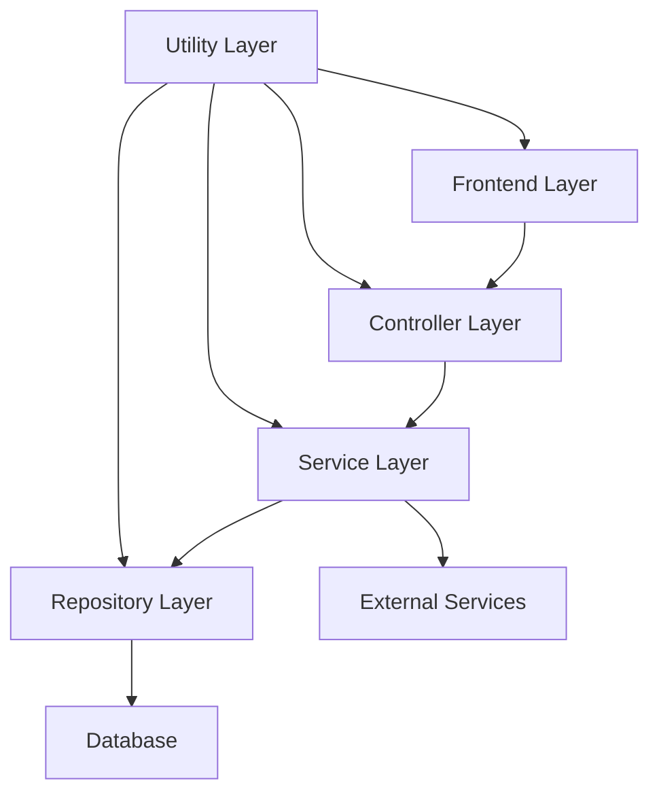
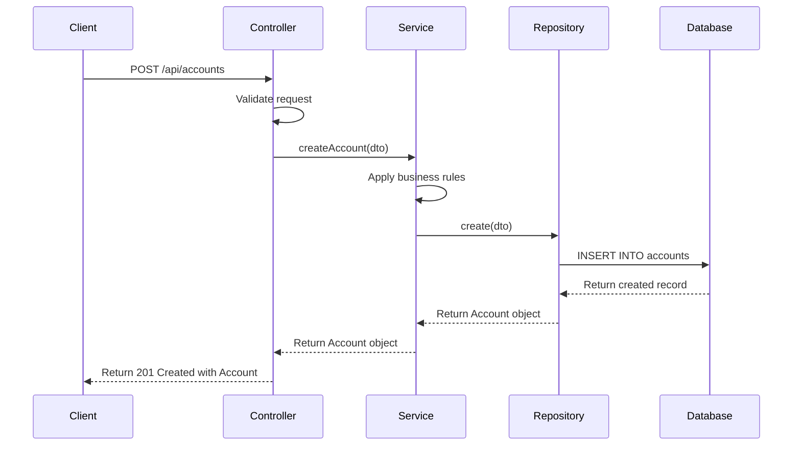
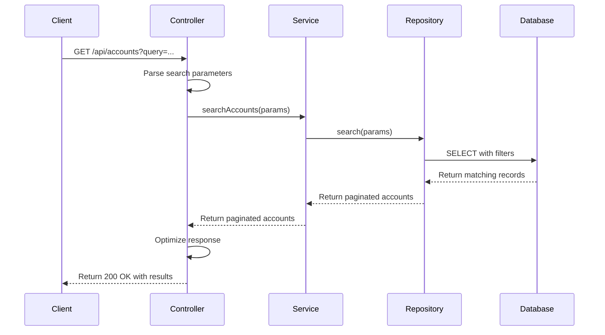

# Customer Account Management System - Architecture Overview

## System Architecture

The Customer Account Management System follows a layered architecture designed for maintainability, testability, and scalability. Each layer has specific responsibilities and communicates with adjacent layers through well-defined interfaces.

### Layer Responsibilities

#### Frontend Layer
- Presentation of data to users
- User interaction handling
- State management
- Client-side validation
- Optimized rendering

#### Controller Layer
- HTTP request handling
- Input validation
- Response formatting
- Error handling
- Authentication and authorization checks

#### Service Layer
- Business logic implementation
- Transaction management
- Integration with external services
- Complex validation rules
- Permission enforcement

#### Repository Layer
- Data access operations
- Query optimization
- Database schema management
- Data mapping between domain models and database entities

#### Utility Layer
- Cross-cutting concerns
- Logging and monitoring
- Caching mechanisms
- Response optimization
- Security utilities

## Data Flow

### Account Creation Flow

### Account Search Flow

## Performance Optimization Strategies

### Database Optimizations
- Strategic indexing for common search fields
- Composite indexes for frequently combined filters
- Query optimization for relationship traversal
- Efficient pagination implementation

### API Response Optimizations
- Response compression using gzip
- JSON payload optimization by removing null/undefined values
- Efficient serialization techniques
- Strategic caching with appropriate cache headers

### Frontend Optimizations
- Component memoization to prevent unnecessary re-renders
- Lazy loading of components and data
- Debouncing for search operations
- Client-side caching of frequently accessed data

## Security Architecture

### Authentication & Authorization
- JWT-based authentication
- Role-based access control
- Permission checking at service layer
- Audit logging for sensitive operations

### Data Protection
- Encryption of sensitive data
- GDPR compliance features
- Data anonymization capabilities
- Secure deletion procedures

## Monitoring & Observability

### Performance Monitoring
- Response time tracking for critical operations
- Query performance monitoring
- Frontend rendering performance metrics
- Resource utilization tracking

### Error Handling
- Centralized error logging
- Structured error responses
- Graceful degradation strategies
- Automatic retry mechanisms for transient failures

## Scalability Considerations

### Horizontal Scaling
- Stateless service design
- Database connection pooling
- Efficient caching strategies
- Asynchronous processing for resource-intensive operations

### Vertical Scaling
- Query optimization for efficient resource utilization
- Memory usage optimization
- Connection management
- Efficient data structures and algorithms